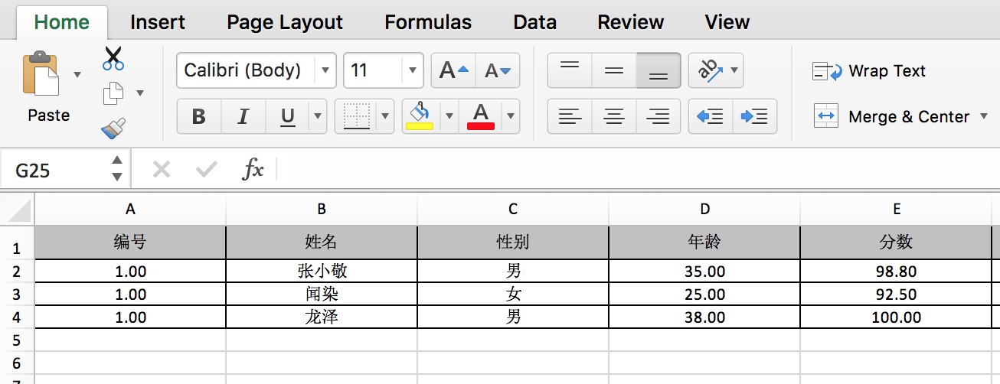

### 功能
包装Apache-pio API对外提供以下静态方法：

- 将Java实体集合转成Excel文档
- Excel文件转成Java对象集合

### 快速开始

- Java 转 Excel

    ```java
    // 指定excel列和对象属性的对应关系
    excelColumns.add(new ExcelColumn("id", "编号"));
    excelColumns.add(new ExcelColumn("name", "姓名"));
    excelColumns.add(new ExcelColumn("sex", "性别"));
    excelColumns.add(new ExcelColumn("age", "年龄"));
    excelColumns.add(new ExcelColumn("score", "分数"));
    // 构造一些User对象供测试
    List<User> users = new ArrayList<>();
    users.add(new User(1L, "张小敬", '男', 35, 98.8d));
    users.add(new User(1L, "闻染", '女', 25, 92.5d));
    
    ExcelUtil.object2Excel(excelColumns, users, "/Users/nmyphp/User.xlsx");
    ```
    运行后在指定目录/Users/nmyphp/User.xlsx生成如下excel文件如下：
    
    
    
- Excel 转 Java
    
    ```java
    // 指定excel列和对象属性的对应关系
    ExcelHead excelHead = new ExcelHead();
    excelColumns.add(new ExcelColumn("id", "编号"));
    excelColumns.add(new ExcelColumn("name", "姓名"));
    excelColumns.add(new ExcelColumn("sex", "性别"));
    excelColumns.add(new ExcelColumn("age", "年龄"));
    excelHead.setColumns(excelColumns);
    
    List<User> transResult = ExcelUtil.excel2Object("/Users/nmyphp/User.xlsx", excelHead, User.class);
    // 输出
    System.out.println(new Gson().toJson(transResult));
    ```
    运行后输出Json如下：
    ```json
    [
        {
            "id":1,
            "name":"张小敬",
            "sex":"男",
            "age":35,
            "score":98.8
        },
        {
            "id":1,
            "name":"闻染",
            "sex":"女",
            "age":25,
            "score":92.5
        },
        {
            "id":1,
            "name":"龙泽",
            "sex":"男",
            "age":38,
            "score":100
        }
    ]
    ```